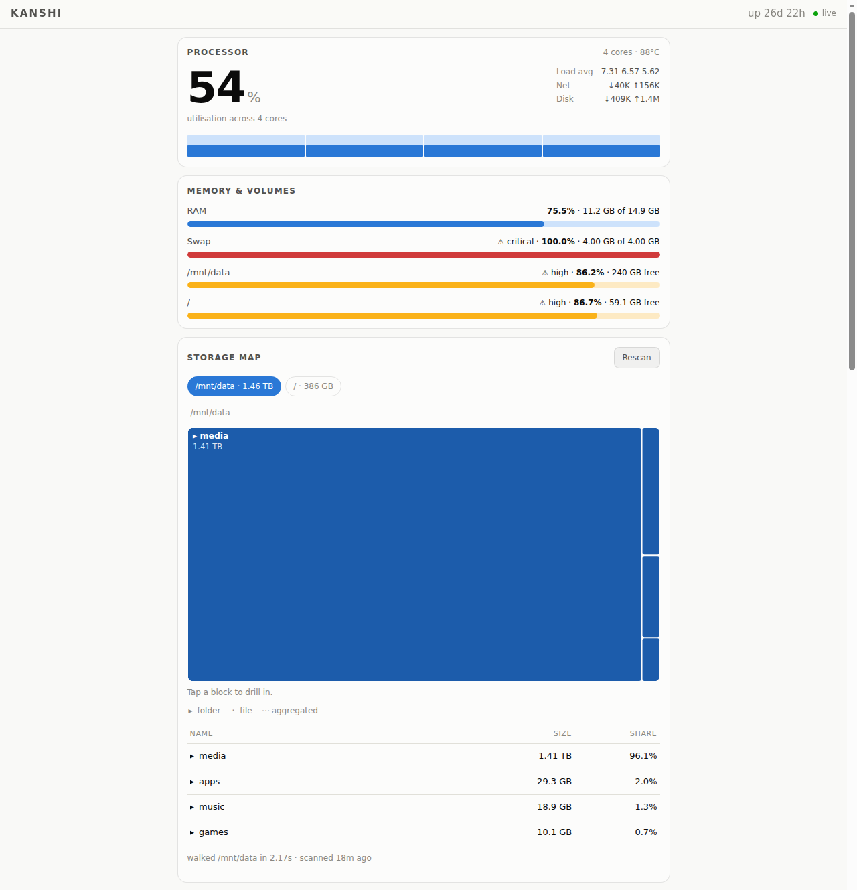
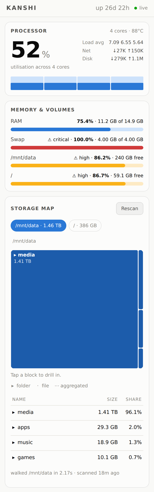

<div align="center">

# kanshi

**A one-page, mobile-first glance at this homeserver.**

Live CPU and RAM, a Filelight-style storage treemap, and `docker stats` for
every container — no historical storage, no alerting, no external services.

[](https://www.python.org/)
[](https://fastapi.tiangolo.com/)
[](https://docs.docker.com/compose/)
[](https://www.npmjs.com/package/@yuuki824/kanshi)

</div>

---

## Screenshots

<table>
<tr>
<td width="60%">

**Vitals & storage** — live CPU/RAM meters and the storage treemap


</td>
<td width="40%">

**Mobile** — the same cards, stacked for a phone screen


</td>
</tr>
</table>

By default it is reachable only from the local machine:

    http://localhost:8100

## Features

- 📊 **Processor** — hero utilisation %, per-core bars, load average, temperature, host net/disk throughput
- 🧠 **Memory & volumes** — RAM, swap, and one meter per storage root
- 🗺 **Storage map** — squarified treemap you can tap to drill into, with a table twin below; depth-bounded so it stays fast on large filesystems
- 🐳 **Containers** — per-container CPU%, memory, network rate and health straight from the Docker Engine API
- ⚡ **One SSE connection** — the server pushes every tick over `/api/stream`; nothing polls, nothing needs a manual reload
- 😴 **Idles to near-zero** — the poller and the Docker socket both go quiet after `KANSHI_IDLE_TIMEOUT` with nobody watching
- 🔒 **Tailscale-friendly** — binds to `127.0.0.1` by default; point it at a Tailscale IP to share it on a tailnet instead of the open LAN

## Tech Stack

| Layer | Choice |
|---|---|
| Backend | Python 3.12, FastAPI + Uvicorn, `psutil` |
| Live updates | Server-Sent Events (`/api/stream`) |
| Frontend | Vanilla JS, hand-rolled SVG treemap — no build step |
| Container metrics | Docker Engine API (one-shot stats, not the streaming daemon default) |
| Packaging | Docker Compose, published as an `npx` launcher |

## Install with npx

`npx` downloads and runs an npm package; it does not upload a project. This
repository includes a small npm launcher which starts the included Docker
Compose app, so Docker (with the Compose v2 plugin) is still required.

From any directory, run:

```sh
npx @yuuki824/kanshi
```

The first run downloads the package, builds the Docker image, and starts a
container named `kanshi`. Open <http://localhost:8100> once it says the
container started. It may take a minute for the initial health check to pass.

The command is equivalent to `docker compose up -d --build`. To run without
the confirmation prompt:

```sh
npx --yes @yuuki824/kanshi
```

### Manage the container

```sh
# Stop it without removing it.
docker stop kanshi

# Start the stopped container again.
docker start kanshi

# Follow application logs.
docker logs -f kanshi

# Remove the current container, for example before installing an update.
docker rm -f kanshi

# Download the newest package version and start it again.
npx @yuuki824/kanshi@latest
```

You can also pass Docker Compose commands after the package name:

```sh
npx @yuuki824/kanshi logs -f
npx @yuuki824/kanshi down
```

### Network access

Kanshi listens on `127.0.0.1:8100` by default, so it is private to the host.
To share it over Tailscale, use the machine's Tailscale IP:

```sh
KANSHI_HOST="$(tailscale ip -4)" npx @yuuki824/kanshi
```

Do not use `KANSHI_HOST=0.0.0.0` unless the machine is protected by an
authenticated reverse proxy: the dashboard can read Docker information.

### Troubleshooting

Check whether the container is running and inspect a restart or startup error:

```sh
docker ps --filter name=kanshi
docker logs --tail=100 kanshi
```

To publish the launcher, use:

```sh
npm login
npm run test
npm run pack:check
npm publish
```

The scoped package is configured to publish publicly. Use a unique package
name you control; `npm publish --dry-run` is a final check that uploads nothing.

## Run it

```sh
docker compose up -d --build
```

Copy `.env.example` to `.env` to override anything. Every setting has a
conservative default; the file documents each one.

## API

| Card | Source | Refresh |
|---|---|---|
| Processor — hero %, per-core bars, load, temp, host net/disk throughput | `psutil` over `/proc` | every `KANSHI_POLL_INTERVAL` (5s) |
| Memory & volumes — RAM, swap, one meter per storage root | `psutil` + `statvfs` | same tick |
| Storage map — squarified treemap, tap to drill, table twin below | cached `os.scandir` walk | every `KANSHI_STORAGE_INTERVAL` (30m), or the Rescan button |
| Containers — CPU%, memory, network rates, health | Docker Engine API | same tick |

The browser holds **one SSE connection** (`/api/stream`) and the server pushes
each tick, so nothing polls and nothing needs a manual reload. There is also a
plain REST surface: `/api/vitals`, `/api/containers`, `/api/storage`,
`POST /api/storage/rescan`, `/healthz`.

## Design notes

**It stops working when you stop looking.** After `KANSHI_IDLE_TIMEOUT` with no
browser attached, the poller stops entirely and the Docker socket goes
untouched until someone loads the page. Idle cost is ~0.2% of one core.

**One-shot container stats.** `GET /containers/{id}/stats?stream=false` makes the
daemon block for a full collection cycle so it can populate `precpu_stats` —
measured at **8.3s per tick** across 31 containers. Kanshi uses `one-shot=true`
(**0.07s**) and computes CPU% against the previous tick itself. Same arithmetic,
and a 5s window is steadier to read than the daemon's 1s one.

**The disk walk is depth-bounded.** The tree is pruned to `KANSHI_TREE_DEPTH`
before it is served, so the walk only materialises a node for directories within
that depth — ~2.3k instead of ~96k on this host. Deeper directories are still
fully traversed and counted; their bytes roll up into the nearest kept ancestor.
Sizes come from `st_blocks` (so they match `du`, not apparent size) and
hardlinked files are counted once.

**The walk runs at `nice 10`** in a worker thread. A full pass over `/` takes
~47s, and the live cards keep their exact 5s cadence throughout.

**Unreadable directories are reported, not hidden.** If the walk cannot enter a
directory it is counted and the storage card says so — a silently truncated tree
that under-reports by 300 GB is worse than an obviously incomplete one.

## Permissions

Runs as root with `cap_drop: ALL` plus **`DAC_READ_SEARCH`** — read and traverse
bypass, but *not* write bypass (that would be `DAC_OVERRIDE`). Without it the
walk cannot enter `/home/yuuki` (mode 0750) and silently under-reports the root
filesystem by ~330 GB. The rootfs is read-only and every host mount is `:ro`.

## About kanshi's own memory number

The dashboard will show kanshi using far more memory than you'd expect for a
10 MB Python process. That figure is mostly **reclaimable kernel dentry cache**
charged to its cgroup — an unavoidable side effect of `stat`-ing ~150k files
during a walk. Actual anonymous memory is ~27 MB; `mem_limit` acts as a ceiling
on the cache and the kernel reclaims it under pressure. The number matches what
`docker stats` reports for any container, which is the point.

## Tuning

Slowest thing here is the walk of `/`, dominated by ~100k overlay2 files under
`/var/lib/docker`. To skip it:

```sh
KANSHI_STORAGE_EXCLUDE=/hostfs/var/lib/docker
```

Its ~48 GB then disappears from the `/` total, so only do this if you don't want
it counted.
